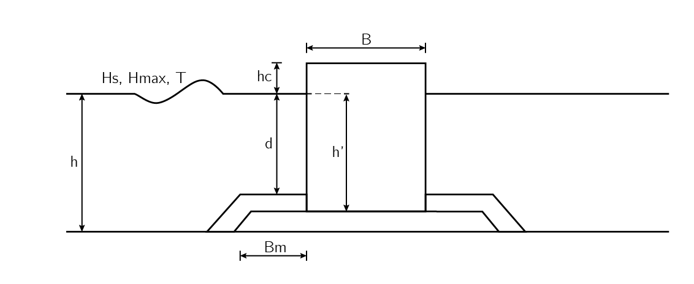

***********************************
Stability of Monolithic breakwaters
***********************************

The implemented formula to determine the stability of a monolithic breakwater is
the extended Goda formula. In figure 9.1 the definition of the used parameters
can be seen.

   Figure 9.1: Definition of the used parameters in the extended Goda formula

.. autoclass:: breakwater.core.goda.Goda
   :members:
