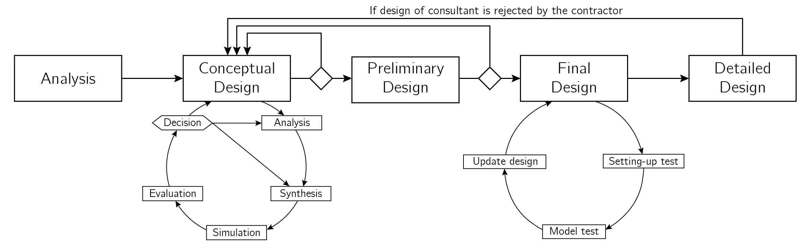

************
Introduction
************

:obj:`breakwater` was developed during my master thesis, see the report here.
The objective of my thesis was to develop a design automation tool that is able
to quickly design different types of breakwaters during the design process. In
this introductory chapter the purpose, background and features of thee tool are
discussed.

Purpose
=======

The main goal of the tool is to support the designer in exploring different
types of breakwaters, see Figure 1.1 for a cross section of the breakwater
types defined by CIRIA, CUR, CETMEF (2007). The main use case of the tool is
thus to make a conceptual design of a breakwater using one of the design classes,
see Chapter `7 <types.html>`__. However, because all functions and classes are
also available from :obj:`breakwater.core` it is also possible to develop your
own design automation script.

.. figure:: _figures/breakwater-types.png
   :align: center
   :alt: Typical cross sections of various types of breakwaters, with the
         rubble mound types on the left and the monolithic types on the right.
         Redrawn from CIRIA, CUR, CETMEF (2007, p.781)

   Figure 1.1: Typical cross sections of various types of breakwaters, with the
   rubble mound types on the left and the monolithic types on the right.
   Redrawn from CIRIA, CUR, CETMEF (2007, p.781)

.. note::
   Due to the limited time not all breakwater types defined by CIRIA, CUR,
   CETMEF (2007) could be implemented. Currently only the following structures
   have been implemented: conventional rubble mound breakwaters with rock and
   armour units as armour layer, caisson breakwaters and vertically
   composite breakwaters.

Background Information
======================

Over the past years several tools have been developed to support the designer
during the breakwater design process, see Figure 1.2. For example the tools
developed by Sijbesma (2019) and Laenen (2000), who both used a probabilistic
design approach to design breakwaters. The tool of Sijbesma (2019) only includes
the conventional rubble mound breakwater with rock as armour layer, where the
tool of Laenen (2000) also includes a caisson breakwater. However, the freedom
of the designer is limited in the tool of Laenen (2000) as, for instance, the
crest width is fixed to 8.6 m.

Furthermore, most tools are not open source available, and can thus not be used
by other designers, or for educational purposes. Moreover, during interviews
it appeared that a probabilistic design approach is perceived as a disadvantage
by designers as such a design approach often results in a too conservative, and
thus too expansive design. The main argument against using probabilistic
design approaches is that there is often a lack of data to effectively use a
probabilistic design approach (Winkel, 2020).

However, the use of generating, and exploring more concepts is beneficial for
the design process, as Davila Delgado and Hofmeyer (2013) showed in their
experimental study. Furthermore, the reports of McKinsey&Company (2017) and
Deloitte (2019) state that the construction industry needs to adopt new digital
technologies to increase the efficiency and productivity, which has been
lagging compared to other industries over the past decades.

Therefore, :obj:`breakwater` aims to automate the synthesis, simulation and
evaluation steps of the conceptual design phase, see Figure 1.2. This is done
to support the designer in exploring concepts, so that the designer can
investigate the influence of several parameters on the design and cost.

         (2020)

   Figure 1.2: General design approach as described in Winkel (2020)

Features
========

:obj:`breakwater` offers the following features to support the designer:

- Design a rubble mound breakwater with rock or concrete armour units as armour
  layer, with :obj:`bw.RockRubbleMound <breakwater.rubble.RockRubbleMound>` or
  :obj:`bw.ConcreteRubbleMound <breakwater.rubble.ConcreteRubbleMound>`

- Design a vertical or vertically composite breakwater with
  :obj:`bw.Caisson <breakwater.caisson.Caisson>`

- Design with an interactive design application by using
  :obj:`bw.interactive_design <breakwater.interactive.interactive_design>`.
  With this application several parameters can be changed with sliders, to
  assess the influence of certain parameters on the design and cost.

- Design multiple breakwaters at ones by using
  :obj:`bw.Configurations <breakwater.design.Configurations>`. With this class
  multiple breakwater types can be designed at ones, these concepts can than
  be assess by using a multi-criteria analysis or with the
  `DesignExplorer <http://tt-acm.github.io/DesignExplorer/>`__.

- Use the functions and classes from :obj:`breakwater.core` to create your own
  design automation approach. The :obj:`breakwater.core` consist of all
  functions and classes defined in Chapters `8 <stability.html>`__ to
  `11 <geo.html>`__

Getting Started
===============

This documentation provides all information required to install the package,
see Chapter `2 <install.html>`__, and start designing breakwaters with Python,
all subsequent chapters.
