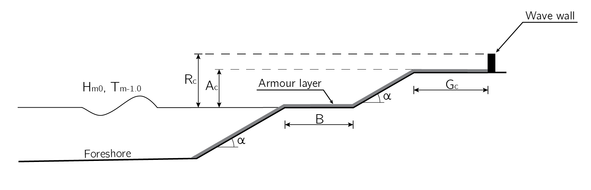
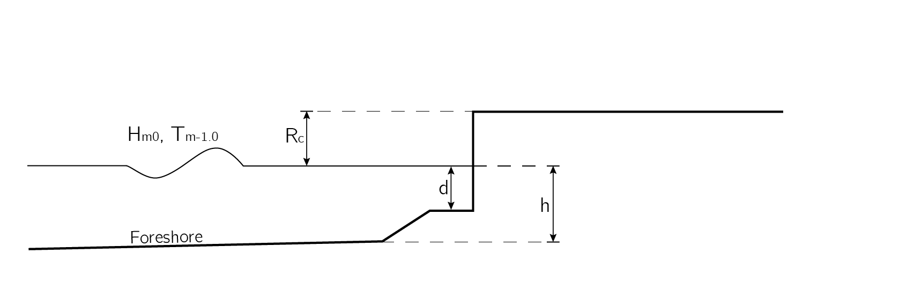
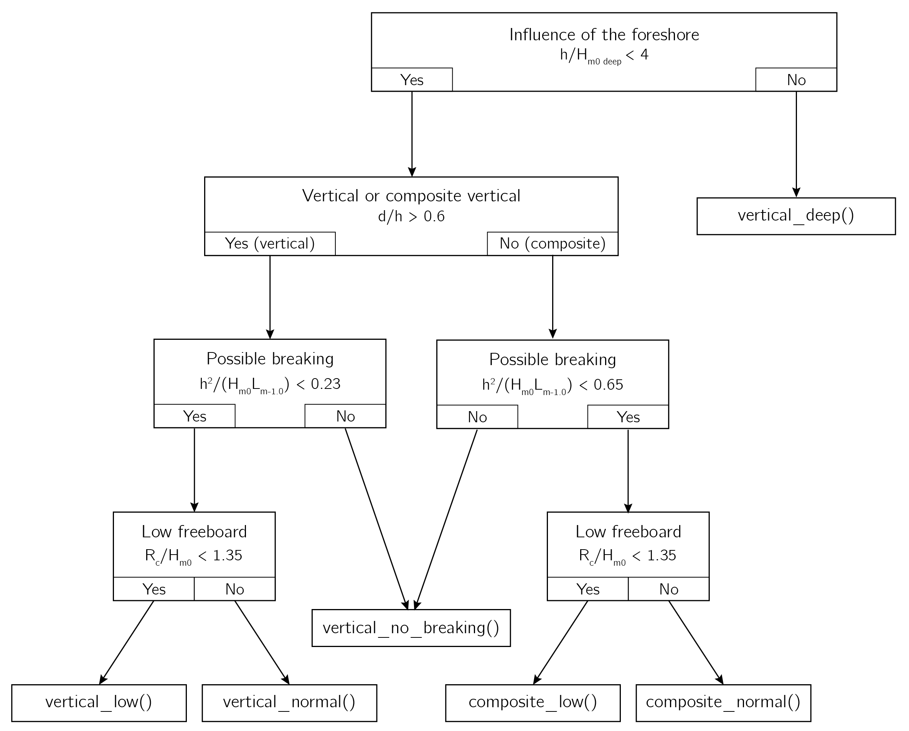

***********
Overtopping
***********

One of the failure mechanisms of a breakwater is overtopping. Overtopping is
defined as the amount of water passing over the crest of the structure per
unit of time, in practice the discharge is often expressed per meter width of
the breakwater as q [:math:`l/s/m`].

.. warning::
   The specific discharge per meter width, q, must be given in :math:`l/s/m`,
   this is automatically converted to :math:`m^3/s/m`

The EurOtop manual is the result of extensive research and experimental
studies on overtopping. All formulas in this module can be found in the
second edition of this manual. The following structures are defined: coastal
dikes, rubble mound breakwaters, vertical walls and vertical composite walls

Rubble mound
============
Rubble mound breakwaters are characterized by a core with some porosity or
permeability, covered by a sloping porous armour layer consisting of large
rock or concrete armour units (for example Xbloc). However, the formula for
coastal and river dikes can be used for a wider range of slopes, and therefore
allows for more flexible input parameters. Since the formula for a rubble
mound breakwater is a simplified case of the coastal or river dike, the
formula for the dike is implemented. The definitions of the variables are
presented in Figure 10.1.

   Figure 10.1: schematisation of a rubble mound breakwater with definitions of
   variables

Formula
-------
The general formula for the average overtopping discharge on a slope (dike,
levee, embankment) implemented is the mean value approach (EurOtop, 2018).
EurOtop (2018) advises against the use of a mean value approach for design
or assessment purposes. Instead, EurOtop (2018) advises to increase the
average discharge by one standard deviation for a design or assessment.
Therefore, 1 is the default setting for the :py:obj:`safety` parameter.

.. autofunction:: breakwater.core.overtopping.rubble_mound

Influence factors
-----------------
The influence of roughness elements, oblique wave attack, berms, etc. are taken
into  account by introducing influence factors

.. autofunction:: breakwater.core.overtopping.gamma_f

.. autofunction:: breakwater.core.overtopping.gamma_beta

.. note:: The formulas for :math:`\gamma_b, \gamma_v, \gamma_*` have not yet
          been implemented. These must thus be computed by hand.

Vertical and Composite Vertical
===============================
The vertical and composite vertical walls are comparable structure, the
difference between is the depth in front of the vertical wall. A composite
vertical wall is fronted by a berm or toe mound below the water level, whereas
a vertical wall is not fronted by such a berm, in that case d = h. In
figure 10.2 a definition sketch of both structures is presented.

   Figure 10.2: schematisation of a vertical or composite vertical wall with
   definitions of variables

More than one equation have been derived to compute the overtopping discharge,
or crest freeboard. Therefore, a general formula is implemented which
automatically classifies the structure in order so that the correct formula is
used.

General Formula
---------------
The general formula is an implementation of the decision chart from EurOtop
(2018). In figure 10.3 the implemented decision chart is depicted with the
references to the individual formulas.

         or composite vertical wall

   Figure 10.3: decision chart for prediction of overtopping discharge for a vertical
   or composite vertical wall

.. autofunction:: breakwater.core.overtopping.vertical

Formulas
--------

.. autofunction:: breakwater.core.overtopping.vertical_deep

.. autofunction:: breakwater.core.overtopping.vertical_no_breaking

.. autofunction:: breakwater.core.overtopping.vertical_normal

.. autofunction:: breakwater.core.overtopping.vertical_low

.. autofunction:: breakwater.core.overtopping.composite_normal

.. autofunction:: breakwater.core.overtopping.composite_low
