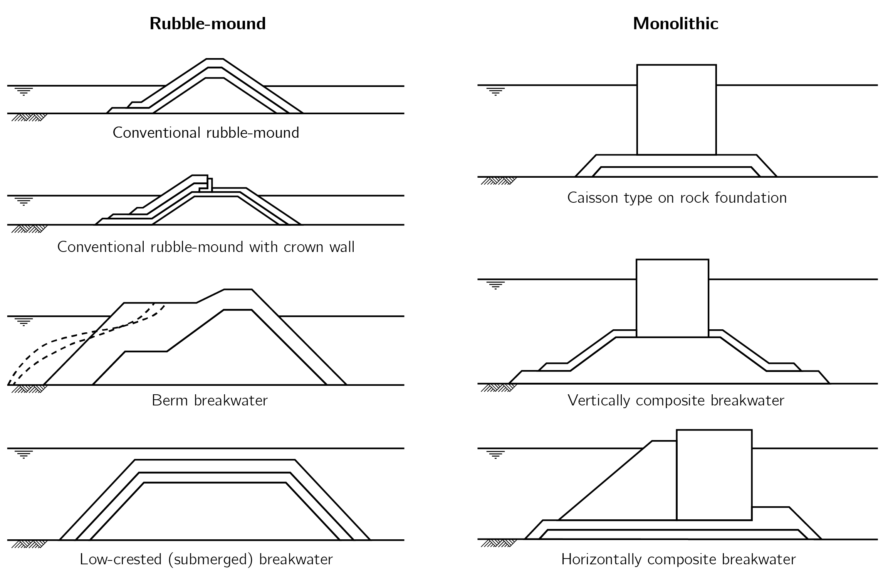
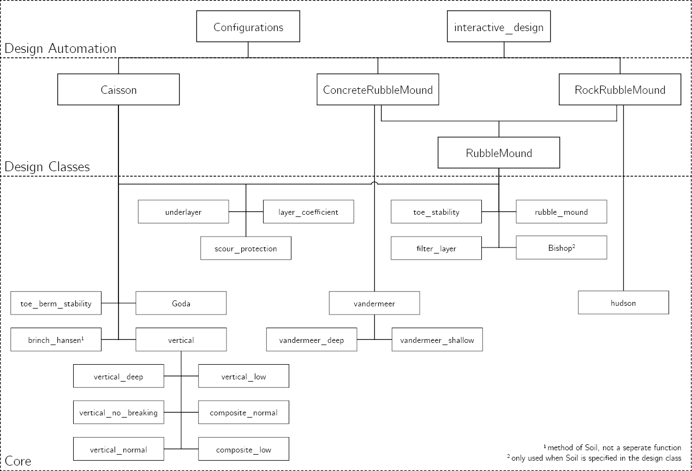
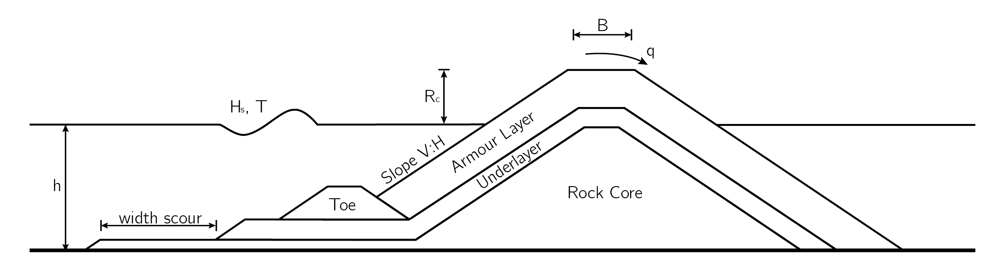
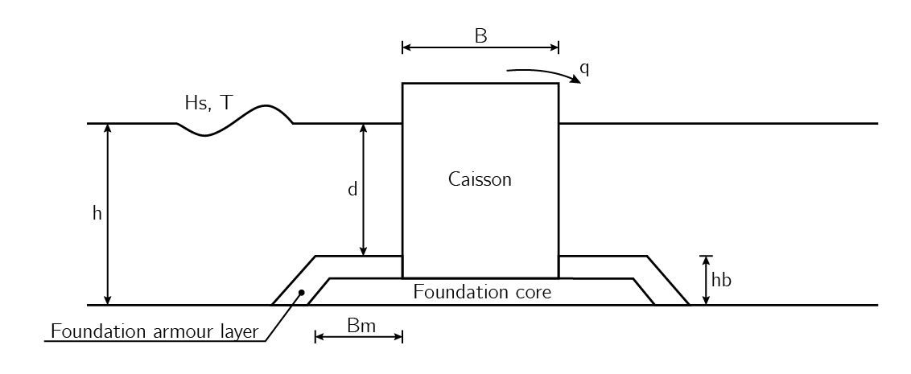

****************
Breakwater types
****************

There are several types of breakwaters, the different types can be divided into
two categories. Rubble mound breakwaters which are made out of large heaps of
loose elements, and monolithic breakwaters which have a cross section acting as
one block, for instance a caisson. Figure 7.1 depicts the representative cross
sections for all breakwater types defined by CIRIA, CUR, CETMEF (2007, p. 781).

   Figure 7.1: Representative cross section of various types of breakwaters,
   Rubble mound types on the left and the monolithic types on the right.
   Redrawn from CIRIA, CUR, CETMEF (2007, p. 781).

The following breakwater types from Figure 7.1 have been implemented:
conventional rubble mound breakwater, caisson breakwater and the vertically
composite breakwater. For each of these structures a class is defined with
which a conceptual design can be made. These classes automatically use the
functions and classes from the :obj:`breakwater.core`, see Figure 7.2.

   Figure 7.2: Implementation of the :obj:`breakwater.core`, all functions and
   classes from Chapters `8 <stability.html>`__ to `11 <geo.html>`__, in the
   design classes.

Conventional Rubble Mound
=========================

As mentioned in the introduction a rubble mound breakwater is made out of large
heaps of loose elements, the armour layer of these types are made with either
rock or concrete armour units such as Xbloc or XblocPlus. Both types of armour
layer can be used to design a breakwater. Figure 7.3 depicts the used definition
of a conventional rubble mound breakwater, for both types of armour layer.

   Figure 7.3: Definitions for a rubble mound breakwater

Rock
----

.. autoclass:: breakwater.rubble.RockRubbleMound
   :members:
   :inherited-members:

Armour Units
------------

.. autoclass:: breakwater.rubble.ConcreteRubbleMound
   :members:
   :inherited-members:

(Composite) vertical
====================

The caisson type and vertical composite breakwater are included in one design
class as they are basically the same structures. The main difference is the
water depth immediately in front of the caisson. In this package the
classification criteria from EurOtop (2018) is used, which classifies a vertical
breakwater as vertical if :math:`\frac{d}{h} > 0.6`, else the breakwater is
classified as a vertically composite breakwater. In Figure 7.4 the definition
of all parameters is depicted.

   Figure 7.4: Definitions for a (composite) vertical breakwater

.. autoclass:: breakwater.caisson.Caisson
   :members:
